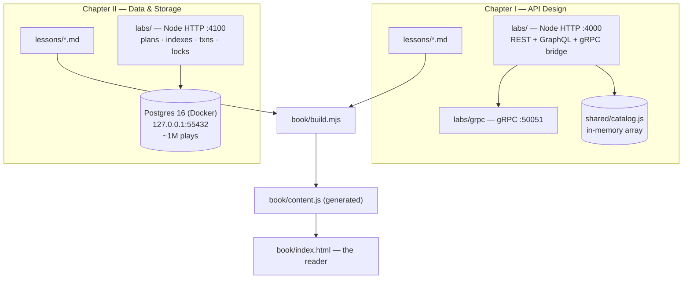

# Architecture

How this repository is put together, what technology is used where, and why. Kept in sync
with the code — if this document and the code disagree, the document is the bug.

## Shape of the whole

This is a *courseware* repo, not an application. It holds three kinds of thing:

1. **Lesson prose** — numbered markdown, one file per lesson, per chapter. The master copy of
   every word in the course.
2. **Labs** — a small, runnable server per chapter, plus a browser UI, so every claim in the
   prose can be measured rather than believed.
3. **The reader** — a static site that typesets (1) into a book.

## Tech stack by layer

| Layer | Technology | Why |
|---|---|---|
| Lesson prose | Plain markdown | The master copy; readable on GitHub without a build |
| Chapter I lab server | Node ≥20, `node:http`, no framework | The course is *about* the mechanism; a framework would hide it |
| Chapter I protocols | `graphql`, `@grpc/grpc-js`, `@grpc/proto-loader`, `protobufjs` | Real implementations of the three styles, not simulations |
| Chapter II lab server | Node ≥20, `node:http`, `pg` | Same reasoning; `pg` is the thinnest honest Postgres client |
| Chapter II datastore | Postgres 16 (alpine) in Docker Compose | Only the database is containerised — it is the only genuinely annoying dependency |
| Lab UIs | Vanilla HTML/CSS/JS, classic scripts | No build step; view-source is part of the teaching |
| Reader | Vanilla JS + a hand-rolled markdown→HTML build (`book/build.mjs`) | Zero dependencies; `index.html` opens from `file://` |

## Component responsibilities

### `API Design/labs/`
One Node process on **:4000** serves all three API styles over one shared catalogue, so any
measured difference is a contract difference, not a data difference.

- `server.js` — the host: static UI, route dispatch, the `/compare` benchmark endpoint.
- `rest/api.js`, `graphql/api.js` — the REST and GraphQL contracts.
- `grpc/server.js` — a real gRPC service on **127.0.0.1:50051**, started as a child of the
  lab host (`npm run grpc` runs it standalone).
- `grpc/bridge.js` — browsers cannot speak gRPC; this proxies UI calls to :50051.
- `shared/catalog.js` — the domain, as an in-memory array. Deliberately free to read; that
  free-ness is the lie Chapter II exists to expose.

### `Data & Storage/labs/`
One Node process on **:4100** against a containerised Postgres on **127.0.0.1:55432**.

- `docker-compose.yml` — `postgres:16-alpine`, pinned knobs (`shared_buffers=256MB`,
  `work_mem=8MB`, `log_min_duration_statement=0`) so the lessons can quote real numbers, and
  `--locale=C` so `EXPLAIN` output is identical across machines.
- `db/init/01-schema.sql`, `02-seed.sql` — catalogue plus ~1,000,000 `plays` rows. Chapter I's
  three artists keep their ids (`a1`, `a2`, `a3`).
- `pg/db.js` — the pool. `pg/plans.js`, `pg/indexes.js`, `pg/scenarios.js`, `pg/workloads.js`
  are one module per lab tab.
- `pg/wait.js` — readiness gate. **Why it exists:** the Compose healthcheck queried `plays`,
  which exists (empty) the moment the schema runs, so the container reported healthy with zero
  rows seeded. The seed's final statement now writes a `lab_ready` sentinel table and readiness
  reads that instead.

### `book/`
`build.mjs` walks the chapters listed in `book.config.json`, converts each chapter's
`lessons/*.md` in filename order, and writes **`content.js` — generated, never edited by
hand**. `reader.js` handles routing, contents, keyboard nav and resume; `localStorage` is used
for resume and degrades gracefully when unavailable.

Adding a chapter = write `<Chapter>/lessons/NN-*.md`, add an entry to `book.config.json`,
run `node build.mjs`.

## Data flow

- **Chapter I:** browser → :4000 → (REST handler | GraphQL executor | gRPC bridge → :50051) →
  `shared/catalog.js`. The Compare tab issues the same logical query through all three and
  reports round trips, bytes and wall time.
- **Chapter II:** browser → :4100 → `pg` pool → Postgres :55432. Endpoints return real
  `EXPLAIN (ANALYZE, BUFFERS)` output and real transaction outcomes; nothing is mocked.

## Ports

| Port | What |
|---|---|
| 4000 | Chapter I lab (HTTP) |
| 50051 | Chapter I gRPC service |
| 4100 | Chapter II lab (HTTP) |
| 55432 | Chapter II Postgres (host-bound; deliberately not 5432, so it never fights a local Postgres) |
| 4200 | Optional static server for `book/` |

## Invariants

- Lesson markdown is the single source of truth. The reader never writes back into it, and
  `content.js` is disposable.
- Labs are framework-free on purpose. Adding Express/Apollo/Prisma would defeat the point.
- Every number a lesson quotes must be reproducible in that chapter's lab on a cold machine.
- Chapters share the music-catalogue domain so cross-chapter comparisons stay honest.

---

## Changelog

- **2026-09-02** — Repository published. Documented the two built chapters (API Design,
  Data & Storage), the reader, ports, and the `lab_ready` seeding gate.
