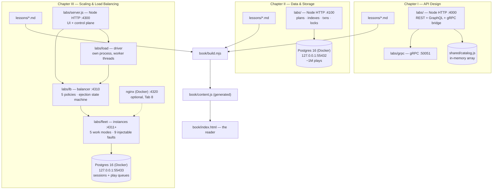

# Architecture

How this repository is put together, what technology is used where, and why. Kept in sync
with the code — if this document and the code disagree, the document is the bug.

## Shape of the whole

This is a *courseware* repo, not an application. It holds three kinds of thing:

1. **Lesson prose** — numbered markdown, one file per lesson, per chapter. The master copy of
   every word in the course.
2. **Labs** — a small, runnable server per chapter, plus a browser UI, so every claim in the
   prose can be measured rather than believed.
3. **The reader** — a static site that typesets (1) into a book.

## Tech stack by layer

| Layer | Technology | Why |
|---|---|---|
| Lesson prose | Plain markdown | The master copy; readable on GitHub without a build |
| Chapter I lab server | Node ≥20, `node:http`, no framework | The course is *about* the mechanism; a framework would hide it |
| Chapter I protocols | `graphql`, `@grpc/grpc-js`, `@grpc/proto-loader`, `protobufjs` | Real implementations of the three styles, not simulations |
| Chapter II lab server | Node ≥20, `node:http`, `pg` | Same reasoning; `pg` is the thinnest honest Postgres client |
| Chapter II datastore | Postgres 16 (alpine) in Docker Compose | Only the database is containerised — it is the only genuinely annoying dependency |
| Chapter III lab server | Node ≥20, `node:http`, `node:cluster`, `pg` | Same reasoning again; `cluster` is what vertical scaling looks like from inside a process |
| Chapter III balancer | Hand-rolled L7 proxy, `node:http` with explicit `http.Agent` | The chapter is about what a balancer decides, so it has to be readable. An explicit agent is also required for correctness — an unbounded upstream pool makes "least connections" meaningless |
| Chapter III load driver | `node:worker_threads`, pre-allocated `Float64Array` | Runs in its own process so the UI's event loop stays out of the timestamps; no allocation in the hot loop, because GC pauses land in the tail latency and get blamed on the server |
| Chapter III datastore | Postgres 16 (alpine), light seed | Here it is a shared state store and a source of honest I/O wait, not the subject — so it is properly indexed, unlike Chapter II's |
| Chapter III comparison | nginx 1.27 (alpine), optional profile | A control to check the hand-rolled balancer against; behaviour only, never throughput (see the invariants) |
| Lab UIs | Vanilla HTML/CSS/JS, classic scripts | No build step; view-source is part of the teaching |
| Reader | Vanilla JS + a hand-rolled markdown→HTML build (`book/build.mjs`) | Zero dependencies; `index.html` opens from `file://` |

## Component responsibilities

### `API Design/labs/`
One Node process on **:4000** serves all three API styles over one shared catalogue, so any
measured difference is a contract difference, not a data difference.

- `server.js` — the host: static UI, route dispatch, the `/compare` benchmark endpoint.
- `rest/api.js`, `graphql/api.js` — the REST and GraphQL contracts.
- `grpc/server.js` — a real gRPC service on **127.0.0.1:50051**, started as a child of the
  lab host (`npm run grpc` runs it standalone).
- `grpc/bridge.js` — browsers cannot speak gRPC; this proxies UI calls to :50051.
- `shared/catalog.js` — the domain, as an in-memory array. Deliberately free to read; that
  free-ness is the lie Chapter II exists to expose.

### `Data & Storage/labs/`
One Node process on **:4100** against a containerised Postgres on **127.0.0.1:55432**.

- `docker-compose.yml` — `postgres:16-alpine`, pinned knobs (`shared_buffers=256MB`,
  `work_mem=8MB`, `log_min_duration_statement=0`) so the lessons can quote real numbers, and
  `--locale=C` so `EXPLAIN` output is identical across machines.
- `db/init/01-schema.sql`, `02-seed.sql` — catalogue plus ~1,000,000 `plays` rows. Chapter I's
  three artists keep their ids (`a1`, `a2`, `a3`).
- `pg/db.js` — the pool. `pg/plans.js`, `pg/indexes.js`, `pg/scenarios.js`, `pg/workloads.js`
  are one module per lab tab.
- `pg/wait.js` — readiness gate. **Why it exists:** the Compose healthcheck queried `plays`,
  which exists (empty) the moment the schema runs, so the container reported healthy with zero
  rows seeded. The seed's final statement now writes a `lab_ready` sentinel table and readiness
  reads that instead.

### `Scaling & Load Balancing/labs/`
Four processes and a container, and the separation between them is the design.

- `server.js` — the lab host on **:4300**. Serves the UI and the control plane, and deliberately
  does NOT generate load: its event loop is busy serving the browser, and its turns would land
  directly in the latency numbers it is meant to report.
- `fleet/instance.js` — the app being scaled. Five work modes (`cpu`, `io:query`, `io:scan`,
  `io:sleep`, `mixed`) and nine injectable faults. Forked, never spawned, so the IPC channel exists:
  `process.on('disconnect')` is what makes orphaned instances impossible when the host dies hard,
  which matters on Windows where there is no graceful SIGTERM.
- `fleet/supervisor.js` — spawn, kill, drain, reap. Revive travels over IPC rather than HTTP,
  because a `dead` instance has no listener and a `hung` one never answers: the control path must
  not share a failure domain with the thing it is rescuing.
- `fleet/faults.js` — the fault catalogue, in its own module. It lives apart from `instance.js`
  because importing that file executes it, and the Health tab importing the catalogue once started
  a phantom app instance inside the lab host.
- `lb/` — the balancer on **:4310**, its five policies, and the ejection state machine. Every
  parameter in `health.js` is named with its trade rather than buried.
- `load/` — the driver (own process, worker threads), plus three modules that exist to stop it
  lying: `budget.js` sizes every sweep from the cores actually available, `calibrate.js` measures
  the work unit, the platform timer floor and thermal drift, and `histogram.js` refuses to report
  a difference smaller than the noise that produced it.
- `bench/` — one module per UI tab, holding the experiments rather than the mechanism.

### `book/`
`build.mjs` walks the chapters listed in `book.config.json`, converts each chapter's
`lessons/*.md` in filename order, and writes **`content.js` — generated, never edited by
hand**. `reader.js` handles routing, contents, keyboard nav and resume; `localStorage` is used
for resume and degrades gracefully when unavailable.

Adding a chapter = write `<Chapter>/lessons/NN-*.md`, add an entry to `book.config.json`,
run `node build.mjs`.

## Data flow

- **Chapter I:** browser → :4000 → (REST handler | GraphQL executor | gRPC bridge → :50051) →
  `shared/catalog.js`. The Compare tab issues the same logical query through all three and
  reports round trips, bytes and wall time.
- **Chapter II:** browser → :4100 → `pg` pool → Postgres :55432. Endpoints return real
  `EXPLAIN (ANALYZE, BUFFERS)` output and real transaction outcomes; nothing is mocked.
- **Chapter III:** browser → :4300 (control plane) → forks the load driver, which drives
  :4310 (balancer) → :4311+ (instances) → Postgres :55433. The browser never generates load itself.
  Every response carries `X-Lab-Instance` and `X-Lab-Chose` so the UI can report which instance
  actually answered rather than trusting the balancer's own bookkeeping.

## Ports

| Port | What |
|---|---|
| 4000 | Chapter I lab (HTTP) |
| 50051 | Chapter I gRPC service |
| 4100 | Chapter II lab (HTTP) |
| 55432 | Chapter II Postgres (host-bound; deliberately not 5432, so it never fights a local Postgres) |
| 4200 | Optional static server for `book/` |
| 4300 | Chapter III lab host — UI and control plane |
| 4310 | Chapter III load balancer — the front door under test |
| 4311-4342 | Chapter III app instances, forked on demand. Bound to 0.0.0.0 rather than loopback so the nginx container can reach them, which does mean they are visible on your LAN while the lab runs |
| 4320 | Chapter III nginx, optional (`npm run nginx:up`) |
| 55433 | Chapter III Postgres (one above Chapter II, so both courses run at once) |

## Invariants

- Lesson markdown is the single source of truth. The reader never writes back into it, and
  `content.js` is disposable.
- Labs are framework-free on purpose. Adding Express/Apollo/Prisma would defeat the point.
- Every number a lesson quotes must be reproducible in that chapter's lab on a cold machine.
- Chapters share the music-catalogue domain so cross-chapter comparisons stay honest.
- Every lab sets an explicit Compose `name:`. Without it Compose derives the project from the
  folder, which is `labs` in every chapter, and starting one course silently recreates another
  course's container. That happened once during Chapter III's build.
- A measurement is only reported alongside the noise that produced it. Chapter III's histogram
  refuses to call a difference significant when it is smaller than the spread between repeats, and
  its load driver measures its own ceiling before measuring anything else.
- Where a comparison cannot be made honestly, the lab refuses it rather than drawing a chart.
  Chapter III's nginx tab compares behaviour and declines to compare throughput, because the
  container crosses a virtual network hop the host-native balancer never pays.

---

## Changelog

- **2026-09-03** — Chapter III (Scaling & Load Balancing) added: a fleet of forked app instances,
  a readable L7 balancer with five policies and an ejection state machine, a load driver that
  measures its own ceiling, and a Postgres on 55433 holding the shared session state. Both earlier
  compose files gained explicit project names after Chapter III's first start recreated Chapter
  II's container. New invariants recorded for measurement honesty and for refusing dishonest
  comparisons.
- **2026-09-02** — Repository published. Documented the two built chapters (API Design,
  Data & Storage), the reader, ports, and the `lab_ready` seeding gate.
